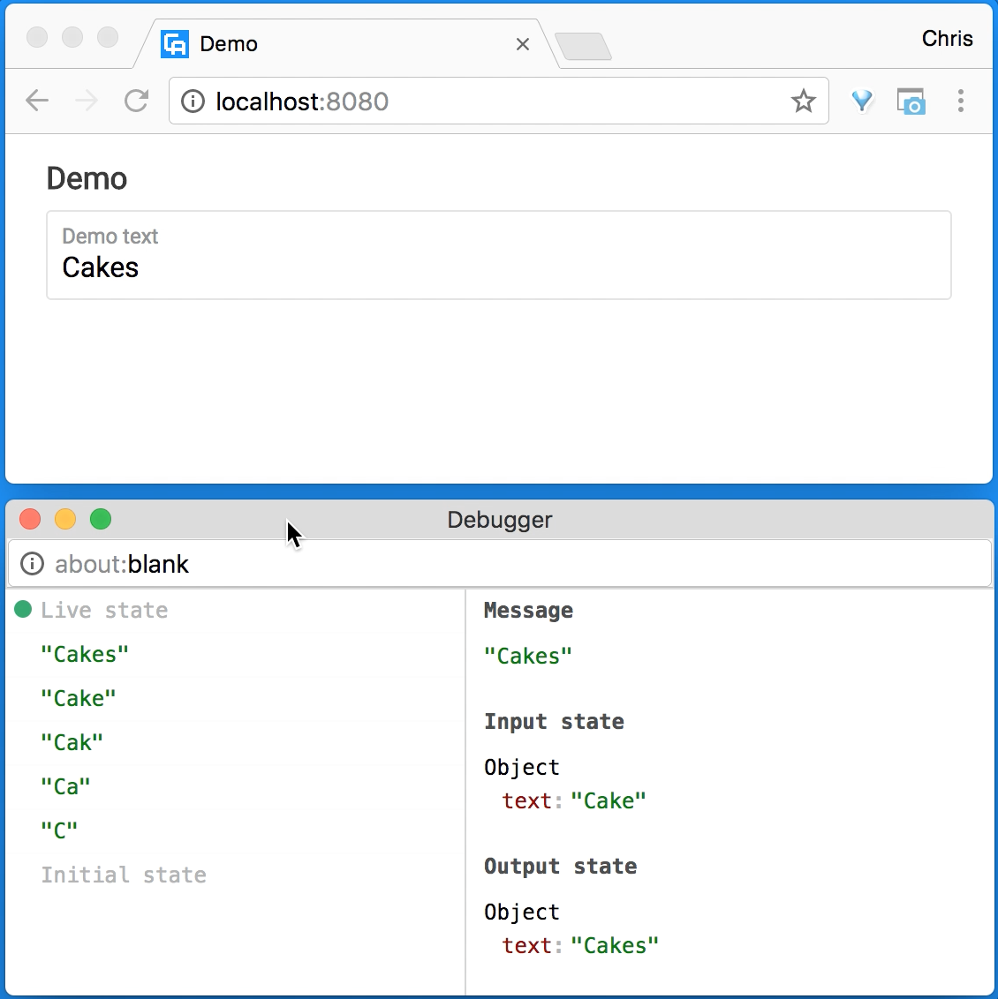

# Raj Web Deubgger
> Web debugger for [Raj](https://github.com/andrejewski/raj)

```sh
npm install raj-web-debugger
```

[](https://www.npmjs.com/package/raj-web-debugger)
[](https://travis-ci.org/andrejewski/raj-web-debugger)
[](https://greenkeeper.io/)

## Demo

<a href='https://vimeo.com/233257980'>
  
</a>

*Click image for video demonstration.*

## Usage
Wrap any standard Raj program in `raj-web-debugger` and use it like normal.

```js
import debug from 'raj-web-debugger'
import myProgram from './my-program'

export default debug(myProgram)
```

## Features

- View library agnostic. The debugger has its own view, independent of the program's and in a separate window to reduce interfering with the inspected program.

- Time-travel. The debugger records every message that goes through the program. Rewind to a previous state by selecting the message from the sidebar that caused it, or cycle through time looking for the state you want to inspect. Use <kbd>J</kbd> to go backward and <kbd>K</kbd> to go forward.

- Pretty printing. Input and output states print out in pretty colors. Custom formatting for [Tagmeme](https://github.com/andrejewski/tagmeme) also makes nested messages more readable in the message list sidebar.

#### Todo
- [ ] Better pretty printing
  - [ ] Collapsable value trees
  - [ ] ES6 Map and Set support
  - [ ] ImmutableJS support
- [ ] Input/output state diff view
- [ ] Effect to message source tracing
- [ ] Keyboard shortcut to open debugger
- [ ] Multi-debugger support
- [ ] Import/export history
